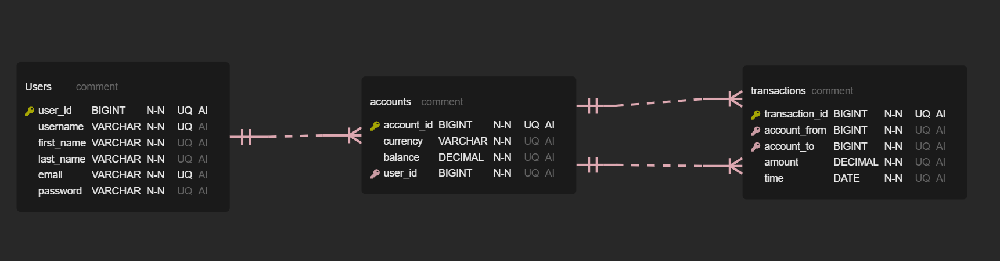

# bog-bank-backend

Bank Transactions, final Project for Bank of Georgia, 'Java Back-End Course'

Detailded API for bank can be seen with Swagger at <http://localhost:8880/swagger-ui/index.html>
or in Postman's json files

## converter-apps API calls

    list all   -  http://localhost:8881/api/convert/
    with amount  -  http://localhost:8881/api/convert/{currency}?amount={int}
    without amount -  http://localhost:8881/api/convert/{currency}

## Database Table Relation

© Vano Ganjelashvili
